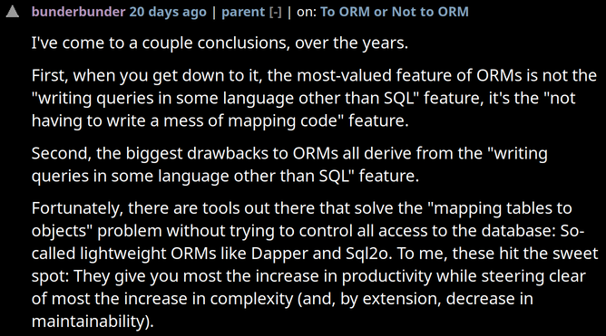

## Bold assertion

(from Hacker News, the easiest place to find bold assertions)

 

 

tl;dr:
* mapping objects to and from a database is a huge win
* building queries in anything other than your database's native query language can lead to issues

[prev](./)&nbsp;&nbsp;&nbsp;&nbsp;[next](./2)